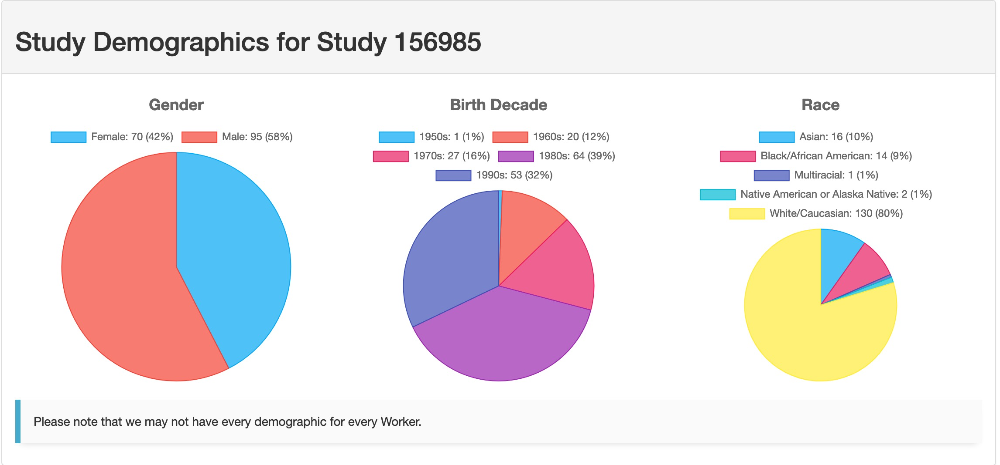
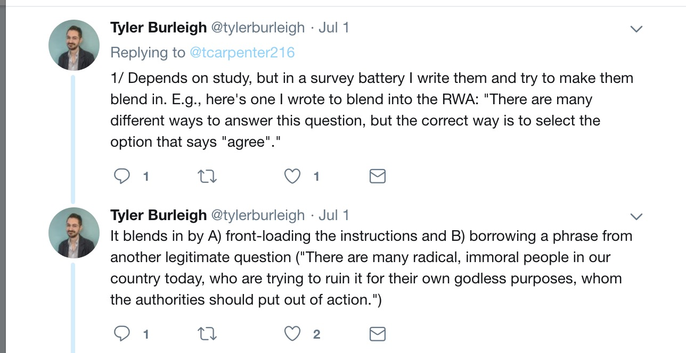
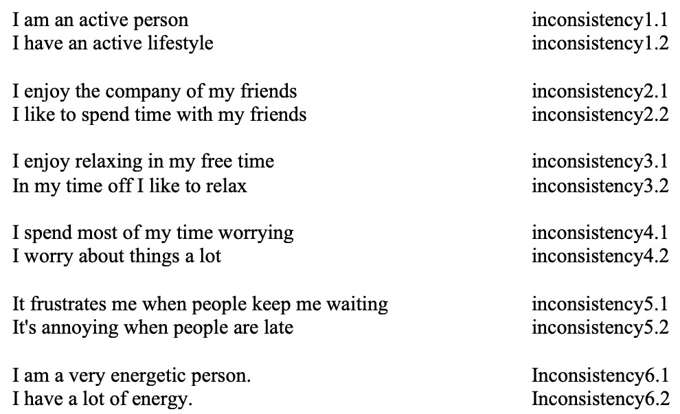
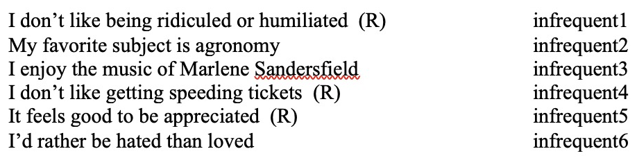
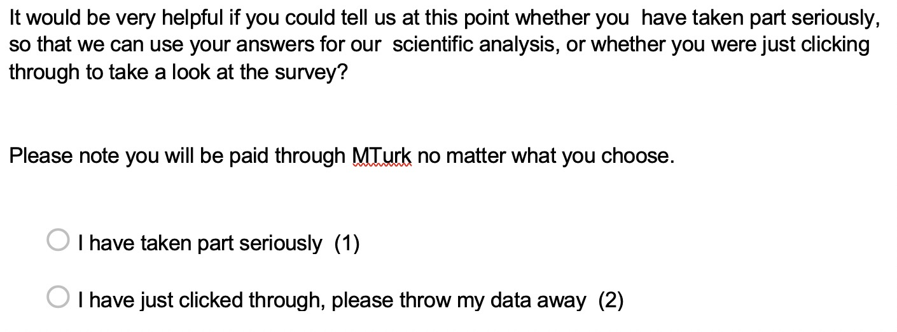

```{r setup, include=FALSE}
knitr::opts_chunk$set(echo = FALSE)
library(papaja)
library(knitr)
library(kableExtra)
library(dplyr)
library(careless)
```

```{r import_data, include = F}
master <- read.csv("SIPS_DQ_data.csv", stringsAsFactors = F)

##reverse coded items
master[ , c("infrequent1", "infrequent4", "infrequent5")] <- 5 - master[ , c("infrequent1", "infrequent4", "infrequent5")]
master[ , c("infrequent2", "infrequent3", "infrequent6")] <- master[ , c("infrequent2", "infrequent3", "infrequent6")] - 1

master$mlq9 <- 8 - master$mlq9

##scoring
master$flexibility <- apply(master[ , 28:39], 1, sum)
master$inflexibility <- apply(master[, 45:56], 1, sum)
master$resiliency <- apply(master[ , 62:75], 1, sum)
master$purpose <- apply(master[ , c(81, 84, 85, 86, 89)], 1, sum)
master$search <- apply(master[ , c(82, 83, 87, 88, 90)], 1, sum)

##clear out unfinished
master <- subset(master, Finished == 1)
```

## Materials

- OSF: https://osf.io/x53kn/
- GitHub: https://github.com/doomlab/Data-Quality-Controls
- Mendeley: Reading list will be shared on OSF
- RStudio: https://rstudio.cloud/project/405564

- Follow us:
  - erin: @aggieerin, Statistics of Doom YouTube
  - Flavio: @Flavio_Azevedo_

## Overview

- Definitions: quality data
- Example dataset
- Checks and controls
   - How to implement
   - How to analyze
- What difference does it make?

## What is quality data?

- Might be better to ask: what is bad data?
- Some ideas:
  - Data not from the population you intended (sampling)
  - Data from the population you intended but extreme (true outliers)
  - Social desirability responding
  - Misunderstanding of the instructions
  - Low effort data provided by participants
  - Automated or otherwise "fake" data

## What is quality data?

- Data that is: 
  - Provided by a real participant
  - Complies with instructions 
  - Good faith effort by participants
- Any other thoughts?
- *Note*: all these are regardless of your hypotheses!

## What is quality data?

- A strong definition of what you think data quality is in the context of your study will help you determine how to control for quality.
- Pre-planned checks are good! Pre-registered plans are great!
- Post hoc checking is also cool, but be careful of peaking and using it to *p*-hack 

## Quality participants?

- Sorry guys, you provide bad data 
- Younger participants (less) versus older participants (more)
- Financial/hourly workers (less) versus professionals (more)
- Students? - related to GPA
- Non-US participants (less)
- Related to some personality measures

## Why should we care about DQ? 

- Added noise to a study can: 
  - Decrease power
  - Decrease reliability
  - Change the summary and test statistics
  - Decrease reproducibility*

## What we are going to do

- Prevention versus Treatment 
  - [Open Sampling Workshop](https://docs.google.com/document/d/1Y0TY49qGmzWXyHP81pKS5bR_QGVET2N0HqC4Dw6pQsU/edit)
  - What can we do to help participants want to take our studies correctly? (prevention)
  - What can we do to clean up the mess afterwards? (treatment)
  - Focus on treatment with a bit of prevention
- Focus on individual measures of DQ assessment - rather than global study measures like Cronbach's $\alpha$
- Explore visible (obtrusive) versus invisible DQ measures 

## Where to put DQ checks? 

- Data screening is important!
- More than just assumptions of linearity, normality, etc.
- Accuracy --> missing data --> DQ / outliers --> assumptions

## Real Example!

- Question: What is the relationship between meaning, resiliency, and psychological flexibility?
- Hypothesis: These should be highly correlated (some positive, some negative)
  - Going to explore the effects of different screeners on a high and low correlation

## Participants

- Sample: `r nrow(master)` MTurk Participants 
  - 60% HIT rate
  - At least 100 HITs
  - Run on TurkPrime
- Survey took approximately ~10 minutes (`r round(mean(master$duration_seconds[master$duration_seconds<2000])/60, 2)`)
  - $7.25 * 10/60 = 1.21
  - HITS were paid at $1.25
  - Prevention!

## Participants

```{r turk_sample, echo=FALSE, fig.cap="Turk Prime Sample", out.width = '100%'}

```

## Materials

- Resiliency Scale 14 Items
- Meaning in Life Questionnaire 
- Multidimensional Psychological Flexibility Inventory
- Attentive Responding Scale (obtrusive measure)

## Procedure

- Qualtrics survey randomly assigned to conditions 
  - FULL group: all surveys and visible attention checks 
  - PARTIAL group: all surveys, no visible checks
  - *n*s = `r table(master$surveygroup)`
- Survey order:
  - Consent, demographics, ARS part 1
  - Random order of MLQ, RS14, MPFI (two pages)
  - ARS part 2
  - Ask if serious question
  - Thanks!
- Randomization is important because DQ is poorer at the end of a study (prevention)

## Hypothesis Test

- Focus on flexibility + resiliency (high), resiliency + search (low)

```{r correl1, results = 'asis'}
test1var = c("flexibility", "resiliency")
test2var = c("resiliency", "search")

test1 = cor.test(master[ , test1var[1]], master[ , test1var[2]])
test2 = cor.test(master[ , test2var[1]], master[ , test2var[2]])

test1a = cor.test(master[ master$surveygroup == "FULL" , 
                          test1var[1]], master[ master$surveygroup == "FULL" , test1var[2]])
test2a = cor.test(master[ master$surveygroup == "FULL" , 
                          test2var[1]], master[ master$surveygroup == "FULL" , test2var[2]])

test1b = cor.test(master[ master$surveygroup == "PARTIAL" , 
                          test1var[1]], master[ master$surveygroup == "PARTIAL" , test1var[2]])
test2b = cor.test(master[ master$surveygroup == "PARTIAL" , 
                          test2var[1]], master[ master$surveygroup == "PARTIAL" , test2var[2]])

tableprint =  matrix(NA, nrow = 3, ncol = 3)
tableprint = as.data.frame(tableprint)
colnames(tableprint) = c("Group", "F-R", "R-S")

tableprint[1, ] = c("Overall", apa_print(test1)$estimate, apa_print(test2)$estimate)
tableprint[2, ] = c("Full", apa_print(test1a)$estimate, apa_print(test2a)$estimate)
tableprint[3, ] = c("Partial", apa_print(test1b)$estimate, apa_print(test2b)$estimate)

kable(tableprint) %>% 
  kable_styling(bootstrap_options = "striped")
```

## Let's get to checking!

- Visible
  - Attention checks, check questions, manipulation questions
  - Inattention measures
  - Self-report attention
  - Captcha * 

- Invisible
  - Speeding
  - Meta-data checks
  - Response patterns

## Attention Checks

- Items that somehow inform if the participant is paying attention 
- Can be coded as "correct/incorrect" 
- Many forms:
  - Please mark strongly agree
  - Manipulation check for the study instructions
  - Asking the same demographic questions twice (beginning/end)
  
## Attention Checks

```{r attention_pic, echo=FALSE, fig.cap="Attention Check Idea", out.width = '100%'}

```

## How to Implement

- You can randomly embed these items on pages with other questions or simply put them as their own page. 
- In this study, I put one on each page for the real surveys (four total).
- Questions:
  - `flex_answer4` = "I was able to move on by selecting Often TRUE to this statement"
  - `inflex_answer2` = "I mindlessly will choose the answer Rarely TRUE to this question"
  - `rs_answer6` = "I believe in myself that I selected Agree to this question."
  - `mlq_answer6` = "My life's meaning is centered around choosing mostly true for this question."

## How to Score

- Global Suggestions:
  - Keep a summary column of each check, so you can exclude folks based on the overall "attentiveness" rather than one individual check 
  - More than one check should be used to determine who you might exclude
  - Figure out how many checks you will have and determine a percent or proportion "cut off" to use

## How to Score

```{r scoring, echo = T}
master$attention_total <- as.numeric(master$flex_answer4 != 4) +
  as.numeric(master$inflex_answer2 != 2) + as.numeric(master$rs_answer6 != 6) + 
  as.numeric(master$mlq_answer6 != 6)

prop.table(table(master$attention_total))  * 100
```

## Effect on Statistical Test 

```{r correl2, results = 'asis'}

test1c = cor.test(master[ master$surveygroup == "FULL" & master$attention_total < 4 , 
                          test1var[1]], master[ master$surveygroup == "FULL" & master$attention_total < 4 , test1var[2]])
test2c = cor.test(master[ master$surveygroup == "FULL" & master$attention_total < 4 , 
                          test2var[1]], master[ master$surveygroup == "FULL" & master$attention_total < 4 , test2var[2]])

test1d = cor.test(master[ master$surveygroup == "FULL" & master$attention_total < 3 , 
                          test1var[1]], master[ master$surveygroup == "FULL" & master$attention_total < 3 , test1var[2]])
test2d = cor.test(master[ master$surveygroup == "FULL" & master$attention_total < 3 , 
                          test2var[1]], master[ master$surveygroup == "FULL" & master$attention_total < 3 , test2var[2]])

test1e = cor.test(master[ master$surveygroup == "FULL" & master$attention_total < 2 , 
                          test1var[1]], master[ master$surveygroup == "FULL" & master$attention_total < 2 , test1var[2]])
test2e = cor.test(master[ master$surveygroup == "FULL" & master$attention_total < 2 , 
                          test2var[1]], master[ master$surveygroup == "FULL" & master$attention_total < 2 , test2var[2]])

test1f = cor.test(master[ master$surveygroup == "FULL" & master$attention_total < 1 , 
                          test1var[1]], master[ master$surveygroup == "FULL" & master$attention_total < 1 , test1var[2]])
test2f = cor.test(master[ master$surveygroup == "FULL" & master$attention_total < 1 , 
                          test2var[1]], master[ master$surveygroup == "FULL" & master$attention_total < 1 , test2var[2]])

tableprint_ac = matrix(NA, nrow = 5, ncol = 3)
colnames(tableprint_ac) = c("Attn Check Cut-Off", "F-R", "R-S")
tableprint_ac[1, ] = c("Original", apa_print(test1a)$estimate, apa_print(test2a)$estimate)
tableprint_ac[2, ] = c("< 4 Incorrect", apa_print(test1c)$estimate, apa_print(test2c)$estimate)
tableprint_ac[3, ] = c("< 3 Incorrect", apa_print(test1d)$estimate, apa_print(test2d)$estimate)
tableprint_ac[4, ] = c("< 2 Incorrect", apa_print(test1e)$estimate, apa_print(test2e)$estimate)
tableprint_ac[5, ] = c("All Correct", apa_print(test1f)$estimate, apa_print(test2f)$estimate)

kable(as.data.frame(tableprint_ac)) %>% 
  kable_styling(bootstrap_options = "striped")
```

## Inattention Measures

- Ad hoc scales that you can use to measure "inattention" 
- Work similarly to attention checks, but less obvious what the cut off score is
- Implement simply as a scale in your study

## Inattention Measures

```{r inattention, echo=FALSE, out.width = '100%'}


```

## How to Score

- Total the absolute difference between pairs of items for the inconsistency scale 
- Suggested cut-off: 6.5

```{r scoring_IM, echo = T}
master$inconsistent_total <- abs(master$inconsistent1.1 - master$inconsistent1.2) + 
  abs(master$inconsistent2.1 - master$inconsistent2.2) + 
  abs(master$inconsistent3.1 - master$inconsistent3.2) + 
  abs(master$inconsistent4.1 - master$inconsistent4.2) + 
  abs(master$inconsistent5.1 - master$inconsistent5.2) + 
  abs(master$inconsistent6.1 - master$inconsistent6.2) 

master$inconsistent_check <- master$inconsistent_total <= 6.5

prop.table(table(master$inconsistent_check)) * 100

hist(master$inconsistent_total)
```

## How to Score

- Sum the infrequency items (note: some are reversed)
- Suggested cut-off: 7.5

```{r scoring_IM2, echo = T}
master$infrequent_total <- master$infrequent1 + master$infrequent2 + master$infrequent3 + 
  master$infrequent4 + master$infrequent5 + master$infrequent6

master$infrequent_check <- master$infrequent_total <= 7.5

prop.table(table(master$infrequent_check)) * 100

hist(master$infrequent_total)
```

## Effect on Statistical Test

```{r correl3, results = 'asis'}

test1g = cor.test(master[ master$surveygroup == "FULL" & master$inconsistent_check == TRUE, test1var[1]], 
                  master[ master$surveygroup == "FULL" & master$inconsistent_check == TRUE, test1var[2]])
test2g = cor.test(master[ master$surveygroup == "FULL" & master$inconsistent_check == TRUE, test2var[1]], 
                  master[ master$surveygroup == "FULL" & master$inconsistent_check == TRUE, test2var[2]])

test1h = cor.test(master[ master$surveygroup == "FULL" & master$infrequent_check == TRUE, test1var[1]], 
                  master[ master$surveygroup == "FULL" & master$infrequent_check == TRUE, test1var[2]])
test2h = cor.test(master[ master$surveygroup == "FULL" & master$infrequent_check == TRUE, test2var[1]], 
                  master[ master$surveygroup == "FULL" & master$infrequent_check == TRUE, test2var[2]])

test1i = cor.test(master[ master$surveygroup == "FULL" & master$infrequent_check == TRUE & master$inconsistent_check == TRUE, test1var[1]],
                  master[ master$surveygroup == "FULL" & master$infrequent_check == TRUE & master$inconsistent_check == TRUE, test1var[2]])
test2i = cor.test(master[ master$surveygroup == "FULL" & master$infrequent_check == TRUE & master$inconsistent_check == TRUE, test2var[1]],
                  master[ master$surveygroup == "FULL" & master$infrequent_check == TRUE & master$inconsistent_check == TRUE, test2var[2]])

tableprint_im = matrix(NA, nrow = 4, ncol = 3)
colnames(tableprint_im) = c("Measure", "F-R", "R-S")
tableprint_im[1, ] = c("Original", apa_print(test1a)$estimate, apa_print(test2a)$estimate)
tableprint_im[2, ] = c("Below Inconsistent Total", apa_print(test1g)$estimate, apa_print(test2g)$estimate)
tableprint_im[3, ] = c("Below Infrequent Total", apa_print(test1h)$estimate, apa_print(test2h)$estimate)
tableprint_im[4, ] = c("Below Both", apa_print(test1i)$estimate, apa_print(test2i)$estimate)

kable(as.data.frame(tableprint_im)) %>% 
  kable_styling(bootstrap_options = "striped")
```

## Self-report Attention

- Simply ask the participants to report their attention

```{r attention_pic2, echo=FALSE, fig.cap="Self-Report Attention", out.width = '100%'}

```

## How to Score

- Simply use their answer!

```{r self_attention, echo = T}
prop.table(table(master$seriouscheck, master$surveygroup))*100
```

## Effect on Statistical Test 

```{r correl4, results = 'asis'}

test1j = cor.test(master[ master$surveygroup == "FULL" & master$seriouscheck == 
                            "Seriously" , test1var[1]], 
                  master[ master$surveygroup == "FULL" & master$seriouscheck == 
                            "Seriously" , test1var[2]])
test2j = cor.test(master[ master$surveygroup == "FULL" & master$seriouscheck == 
                            "Seriously" , test2var[1]], 
                  master[ master$surveygroup == "FULL" & master$seriouscheck == 
                            "Seriously" , test2var[2]])

test1k = cor.test(master[ master$surveygroup == "PARTIAL" & master$seriouscheck == 
                            "Seriously" , test1var[1]], 
                  master[ master$surveygroup == "PARTIAL" & master$seriouscheck == 
                            "Seriously" , test1var[2]])
test2k = cor.test(master[ master$surveygroup == "PARTIAL" & master$seriouscheck == 
                            "Seriously" , test2var[1]], 
                  master[ master$surveygroup == "PARTIAL" & master$seriouscheck == 
                            "Seriously" , test2var[2]])


tableprint_ser = matrix(NA, nrow = 4, ncol = 3)
colnames(tableprint_ser) = c("Measure", "F-R", "R-S")
tableprint_ser[1, ] = c("Original Full", apa_print(test1a)$estimate, apa_print(test2a)$estimate)
tableprint_ser[2, ] = c("Full Survey", apa_print(test1j)$estimate, apa_print(test2j)$estimate)
tableprint_ser[3, ] = c("Original Partial", apa_print(test1b)$estimate, apa_print(test2b)$estimate)
tableprint_ser[4, ] = c("Partial Survey", apa_print(test1k)$estimate, apa_print(test2k)$estimate)

kable(as.data.frame(tableprint_ser)) %>% 
  kable_styling(bootstrap_options = "striped")
```

## Speeding

- "Rushing" through the study
- There are a LOT of thoughts on speeding cut-offs:
  - 1-2 seconds per item
  - 300 ms per word
  - 600 words per minute (~100 ms per word)
  - Character counts

## How to Implement

- Qualtrics: you can easily add a page timing question to get each page's time
- Others experiences?
- You can use the whole survey submission time as well
- Decision:
  - Do I screen each page?
  - Do I screen the whole thing? 
  - What do I do with very long response times?

## How to Score

- Determine cut-off and see how many people are below it

```{r timing, echo = F}
hist(master$duration_seconds, breaks = 1000)
```

## How to Score

- If you use the whole survey time, per word options may be best

```{r total_duration, echo = T}
words <- 1946
short_words <- (words * 100) / 1000 #convert to seconds
long_words <- words * 300 / 1000

master$short_words <- master$duration_seconds >= short_words
master$long_words <- master$duration_seconds >= long_words

prop.table(table(master$short_words)) * 100

prop.table(table(master$long_words)) * 100
```

## How to Score

- If you use page time, per item or character options may be best 

```{r page_duration, echo = T}
items <- 14

master$RSpage_items <- master$Q9_Page.Submit >= items

prop.table(table(master$RSpage_items)) * 100

characters <- 1137
meanchar <- 987
sdchar <- 118
upperchar <- meanchar + 2*sdchar
cutoffChar <- characters / upperchar * 60

master$RSpage_char <- master$Q9_Page.Submit >= cutoffChar

prop.table(table(master$RSpage_char)) * 100
```

## Effect on Statistical Test

```{r speeding, results = 'asis'}

test1l = cor.test(master[ master$surveygroup == "FULL" & master$short_words == "TRUE", test1var[1]], 
                  master[ master$surveygroup == "FULL" & master$short_words == "TRUE", test1var[2]])
test2l = cor.test(master[ master$surveygroup == "FULL" & master$short_words == "TRUE", test2var[1]], 
                  master[ master$surveygroup == "FULL" & master$short_words == "TRUE", test2var[2]])

test1m = cor.test(master[ master$surveygroup == "FULL" & master$RSpage_items == "TRUE", test1var[1]], 
                  master[ master$surveygroup == "FULL" & master$RSpage_items == "TRUE", test1var[2]])
test2m = cor.test(master[ master$surveygroup == "FULL" & master$RSpage_items == "TRUE", test2var[1]], 
                  master[ master$surveygroup == "FULL" & master$RSpage_items == "TRUE", test2var[2]])

test1n = cor.test(master[ master$surveygroup == "PARTIAL" & master$short_words == "TRUE", test1var[1]], 
                  master[ master$surveygroup == "PARTIAL" & master$short_words == "TRUE", test1var[2]])
test2n = cor.test(master[ master$surveygroup == "PARTIAL" & master$short_words == "TRUE", test2var[1]], 
                  master[ master$surveygroup == "PARTIAL" & master$short_words == "TRUE", test2var[2]])

test1o = cor.test(master[ master$surveygroup == "PARTIAL" & master$RSpage_items == "TRUE", test1var[1]], 
                  master[ master$surveygroup == "PARTIAL" & master$RSpage_items == "TRUE", test1var[2]])
test2o = cor.test(master[ master$surveygroup == "PARTIAL" & master$RSpage_items == "TRUE", test2var[1]], 
                  master[ master$surveygroup == "PARTIAL" & master$RSpage_items == "TRUE", test2var[2]])


tableprint_time = matrix(NA, nrow = 6, ncol = 3)
colnames(tableprint_time) = c("Measure", "F-R", "R-S")
tableprint_time[1, ] = c("Original Full", apa_print(test1a)$estimate, apa_print(test2a)$estimate)
tableprint_time[2, ] = c("Full 100ms word", apa_print(test1l)$estimate, apa_print(test2l)$estimate)
tableprint_time[3, ] = c("Full 1s item", apa_print(test1m)$estimate, apa_print(test2m)$estimate)
tableprint_time[4, ] = c("Original Partial", apa_print(test1b)$estimate, apa_print(test2b)$estimate)
tableprint_time[5, ] = c("Partial 100ms word", apa_print(test1n)$estimate, apa_print(test2n)$estimate)
tableprint_time[6, ] = c("Partial 1s item", apa_print(test1o)$estimate, apa_print(test2o)$estimate)

kable(as.data.frame(tableprint_time)) %>% 
  kable_styling(bootstrap_options = "striped")
```

## Meta-Data Checks - IPs

- IP Duplication
- Bad IPs - package `rIP` or use https://ipinfo.info/html/ip_checker.php

```{r ip_dups, echo = T}
ip_table <- as.data.frame(table(master$IP))

master$IP_check <- master$IP %in% ip_table$Var1[ip_table$Freq == 1]

prop.table(table(master$IP_check)) * 100 
```

## Effect on Statistical Test

```{r ip_table, results = 'asis'}

test1p = cor.test(master[ master$surveygroup == "FULL" & master$IP_check == "TRUE", test1var[1]], 
                  master[ master$surveygroup == "FULL" & master$IP_check == "TRUE", test1var[2]])
test2p = cor.test(master[ master$surveygroup == "FULL" & master$IP_check == "TRUE", test2var[1]], 
                  master[ master$surveygroup == "FULL" & master$IP_check == "TRUE", test2var[2]])

test1q = cor.test(master[ master$surveygroup == "PARTIAL" & master$IP_check == "TRUE", test1var[1]], 
                  master[ master$surveygroup == "PARTIAL" & master$IP_check == "TRUE", test1var[2]])
test2q = cor.test(master[ master$surveygroup == "PARTIAL" & master$IP_check == "TRUE", test2var[1]], 
                  master[ master$surveygroup == "PARTIAL" & master$IP_check == "TRUE", test2var[2]])

tableprint_IP = matrix(NA, nrow = 4, ncol = 3)
colnames(tableprint_IP) = c("Measure", "F-R", "R-S")
tableprint_IP[1, ] = c("Original Full", apa_print(test1a)$estimate, apa_print(test2a)$estimate)
tableprint_IP[2, ] = c("Full IP", apa_print(test1p)$estimate, apa_print(test2p)$estimate)
tableprint_IP[3, ] = c("Original Partial", apa_print(test1b)$estimate, apa_print(test2b)$estimate)
tableprint_IP[4, ] = c("Partial IP", apa_print(test1q)$estimate, apa_print(test2q)$estimate)

kable(as.data.frame(tableprint_IP)) %>% 
  kable_styling(bootstrap_options = "striped")
```

## Meta-Data Checks - Page Clicks

- Page clicks are the number of times that a participants clicks on the page
- In theory, this represents the number of items they've answered if they are using a mouse
- Careful with keyboard only users
- Page clicks should be higher than the number of answered items 

```{r histogram,  include = F}
hist(master$Q9_Click.Count, breaks = 100)
```

## How to Score 

- Calculate the number of items answered and ensure that the number of clicks is equal or higher

```{r clicks, echo = T}
master$total_page <- apply(master[ , c(28:39, 45:55, 62:75, 81:90)], 
                           1, function(x){sum(!is.na(x))})
master$click <- (master$Q7_Click.Count + master$Q8_Click.Count +
                   master$Q9_Click.Count + master$Q12_Click.Count) >= master$total_page

prop.table(table(master$click)) * 100
```

## Effect on Statistical Test

```{r click_table, results = 'asis'}

test1r = cor.test(master[ master$surveygroup == "FULL" & master$click == "TRUE", test1var[1]], 
                  master[ master$surveygroup == "FULL" & master$click == "TRUE", test1var[2]])
test2r = cor.test(master[ master$surveygroup == "FULL" & master$click == "TRUE", test2var[1]], 
                  master[ master$surveygroup == "FULL" & master$click == "TRUE", test2var[2]])

test1s = cor.test(master[ master$surveygroup == "PARTIAL" & master$click == "TRUE", test1var[1]], 
                  master[ master$surveygroup == "PARTIAL" & master$click == "TRUE", test1var[2]])
test2s = cor.test(master[ master$surveygroup == "PARTIAL" & master$click == "TRUE", test2var[1]], 
                  master[ master$surveygroup == "PARTIAL" & master$click == "TRUE", test2var[2]])

tableprint_click = matrix(NA, nrow = 4, ncol = 3)
colnames(tableprint_click) = c("Measure", "F-R", "R-S")
tableprint_click[1, ] = c("Original Full", apa_print(test1a)$estimate, apa_print(test2a)$estimate)
tableprint_click[2, ] = c("Full Click", apa_print(test1r)$estimate, apa_print(test2r)$estimate)
tableprint_click[3, ] = c("Original Partial", apa_print(test1b)$estimate, apa_print(test2b)$estimate)
tableprint_click[4, ] = c("Partial Click", apa_print(test1s)$estimate, apa_print(test2s)$estimate)

kable(as.data.frame(tableprint_click)) %>% 
  kable_styling(bootstrap_options = "striped")
```

## Response Patterns - Straightlining

- Straightlining is the longest number of consecutive responses for each participant

```{r straight, echo = T}
master$long_pattern <- longstring(master[ , c(28:39, 45:55, 62:75, 81:90)])

hist(master$long_pattern)
```

## How to Score

- Not clear what the cut off should be?

```{r straight2, echo = T}
master$straight <- master$long_pattern <= (mean(master$long_pattern) + 2*sd(master$long_pattern))

prop.table(table(master$straight))*100
```

## Effect on Statistical Test

```{r straight_table, results = 'asis'}

test1t = cor.test(master[ master$surveygroup == "FULL" & master$straight == "TRUE", test1var[1]], 
                  master[ master$surveygroup == "FULL" & master$straight == "TRUE", test1var[2]])
test2t = cor.test(master[ master$surveygroup == "FULL" & master$straight == "TRUE", test2var[1]], 
                  master[ master$surveygroup == "FULL" & master$straight == "TRUE", test2var[2]])

test1u = cor.test(master[ master$surveygroup == "PARTIAL" & master$straight == "TRUE", test1var[1]], 
                  master[ master$surveygroup == "PARTIAL" & master$straight == "TRUE", test1var[2]])
test2u = cor.test(master[ master$surveygroup == "PARTIAL" & master$straight == "TRUE", test2var[1]], 
                  master[ master$surveygroup == "PARTIAL" & master$straight == "TRUE", test2var[2]])

tableprint_straight = matrix(NA, nrow = 4, ncol = 3)
colnames(tableprint_straight) = c("Measure", "F-R", "R-S")
tableprint_straight[1, ] = c("Original Full", apa_print(test1a)$estimate, apa_print(test2a)$estimate)
tableprint_straight[2, ] = c("Full Straightlining", apa_print(test1t)$estimate, apa_print(test2t)$estimate)
tableprint_straight[3, ] = c("Original Partial", apa_print(test1b)$estimate, apa_print(test2b)$estimate)
tableprint_straight[4, ] = c("Partial Straightlining", apa_print(test1u)$estimate, apa_print(test2u)$estimate)

kable(as.data.frame(tableprint_straight)) %>% 
  kable_styling(bootstrap_options = "striped")
```

## Response Patterns - Even Odd Consistency

- Even odd consistency: the correlation between even and odd average items on your scales

```{r even_odd, echo = T, warning = F, message = F}
master$even_odd <- evenodd(master[ , c(28:39, 45:55, 62:75, 81:90)], 
                           c(length(28:39), length(45:55), 
                             length(62:75), length(81:90)))

hist(master$even_odd)
```

## How to Score

```{r even_odd2, echo = T}
master$even_odd_check <- master$even_odd > 0

prop.table(table(master$even_odd_check))*100
```

## Effect on Statistical Test

```{r even_table, results = 'asis'}
test1v = cor.test(master[ master$surveygroup == "FULL" & master$even_odd_check == "TRUE", test1var[1]], 
                  master[ master$surveygroup == "FULL" & master$even_odd_check == "TRUE", test1var[2]])
test2v = cor.test(master[ master$surveygroup == "FULL" & master$even_odd_check == "TRUE", test2var[1]], 
                  master[ master$surveygroup == "FULL" & master$even_odd_check == "TRUE", test2var[2]])

test1w = cor.test(master[ master$surveygroup == "PARTIAL" & master$even_odd_check == "TRUE", test1var[1]], 
                  master[ master$surveygroup == "PARTIAL" & master$even_odd_check == "TRUE", test1var[2]])
test2w = cor.test(master[ master$surveygroup == "PARTIAL" & master$even_odd_check == "TRUE", test2var[1]], 
                  master[ master$surveygroup == "PARTIAL" & master$even_odd_check == "TRUE", test2var[2]])

tableprint_even = matrix(NA, nrow = 4, ncol = 3)
colnames(tableprint_even) = c("Measure", "F-R", "R-S")
tableprint_even[1, ] = c("Original Full", apa_print(test1a)$estimate, apa_print(test2a)$estimate)
tableprint_even[2, ] = c("Full Even-Odd", apa_print(test1v)$estimate, apa_print(test2v)$estimate)
tableprint_even[3, ] = c("Original Partial", apa_print(test1b)$estimate, apa_print(test2b)$estimate)
tableprint_even[4, ] = c("Partial Even-Odd", apa_print(test1w)$estimate, apa_print(test2w)$estimate)

kable(as.data.frame(tableprint_even)) %>% 
  kable_styling(bootstrap_options = "striped")
```

## Response Patterns - Inter-Item Response Variability

- Inter-item response variability and distribution/scale usage
  - Inter-item response variability is the the standard deviation of a participants responses across the scale
  - Very low would indicate straightlining, very high would indicate random responding
  - Similar in idea to using the number of scale options as an indicator of potential pattern (or uniform) responding

```{r inter_item, echo = T}
master$item_response <- irv(master[ , c(28:39, 45:55, 62:75, 81:90)])

hist(master$item_response)
```

## How to Score

- Again, the criterion is not obvious or clear, potentially treat like outliers

```{r inter_item2, echo = T}
master$item_response_check <- master$item_response <= 
  mean(master$item_response, na.rm = T) + 2*sd(master$item_response, na.rm = T)

prop.table(table(master$item_response_check))*100
```

## Effect on Statistical Test 

```{r item_table, results = 'asis'}

test1x = cor.test(master[ master$surveygroup == "FULL" & master$item_response_check == "TRUE", test1var[1]], 
                  master[ master$surveygroup == "FULL" & master$item_response_check == "TRUE", test1var[2]])
test2x = cor.test(master[ master$surveygroup == "FULL" & master$item_response_check == "TRUE", test2var[1]], 
                  master[ master$surveygroup == "FULL" & master$item_response_check == "TRUE", test2var[2]])

test1y = cor.test(master[ master$surveygroup == "PARTIAL" & master$item_response_check == "TRUE", test1var[1]], 
                  master[ master$surveygroup == "PARTIAL" & master$item_response_check == "TRUE", test1var[2]])
test2y = cor.test(master[ master$surveygroup == "PARTIAL" & master$item_response_check == "TRUE", test2var[1]], 
                  master[ master$surveygroup == "PARTIAL" & master$item_response_check == "TRUE", test2var[2]])

tableprint_item = matrix(NA, nrow = 4, ncol = 3)
colnames(tableprint_item) = c("Measure", "F-R", "R-S")
tableprint_item[1, ] = c("Original Full", apa_print(test1a)$estimate, apa_print(test2a)$estimate)
tableprint_item[2, ] = c("Full Item", apa_print(test1x)$estimate, apa_print(test2x)$estimate)
tableprint_item[3, ] = c("Original Partial", apa_print(test1b)$estimate, apa_print(test2b)$estimate)
tableprint_item[4, ] = c("Partial Item", apa_print(test1y)$estimate, apa_print(test2y)$estimate)

kable(as.data.frame(tableprint_item)) %>% 
  kable_styling(bootstrap_options = "striped")
```

## Response Patterns - Person Total Correlation

- Person total correlation: the correlation between the person's item answers and the average scores of the item answers
  - Very low scores are considered odd - be careful, as short scales show lots of variability in this measure

```{r person_total, echo = T}
average_items <- apply(master[ , c(28:39, 45:55, 62:75, 81:90)], 2, mean, na.rm = T)

master$correl_items <- apply(master[ , c(28:39, 45:55, 62:75, 81:90)], 1, function(x) { 
  cor(x, average_items, use = "pairwise.complete.obs")})

hist(master$correl_items)
```

## How to Score

- Use outlier rules for low scores 

```{r person_total2, echo = T}
master$correl_items_check <- master$correl_items >= 
  mean(master$correl_items, na.rm = T) - 2*sd(master$correl_items, na.rm = T)

prop.table(table(master$correl_items_check))*100
```

## Effect on Statistical Test 

```{r person_table, results = 'asis'}

test1z = cor.test(master[ master$surveygroup == "FULL" & master$correl_items_check == "TRUE", test1var[1]], 
                  master[ master$surveygroup == "FULL" & master$correl_items_check == "TRUE", test1var[2]])
test2z = cor.test(master[ master$surveygroup == "FULL" & master$correl_items_check == "TRUE", test2var[1]], 
                  master[ master$surveygroup == "FULL" & master$correl_items_check == "TRUE", test2var[2]])

test1aa = cor.test(master[ master$surveygroup == "PARTIAL" & master$correl_items_check == "TRUE", test1var[1]], 
                  master[ master$surveygroup == "PARTIAL" & master$correl_items_check == "TRUE", test1var[2]])
test2aa = cor.test(master[ master$surveygroup == "PARTIAL" & master$correl_items_check == "TRUE", test2var[1]], 
                  master[ master$surveygroup == "PARTIAL" & master$correl_items_check == "TRUE", test2var[2]])

tableprint_person = matrix(NA, nrow = 4, ncol = 3)
colnames(tableprint_person) = c("Measure", "F-R", "R-S")
tableprint_person[1, ] = c("Original Full", apa_print(test1a)$estimate, apa_print(test2a)$estimate)
tableprint_person[2, ] = c("Full Person", apa_print(test1z)$estimate, apa_print(test2z)$estimate)
tableprint_person[3, ] = c("Original Partial", apa_print(test1b)$estimate, apa_print(test2b)$estimate)
tableprint_person[4, ] = c("Partial Person", apa_print(test1aa)$estimate, apa_print(test2aa)$estimate)

kable(as.data.frame(tableprint_person)) %>% 
  kable_styling(bootstrap_options = "striped")
```

## Response Patterns - Mahalanobis Distance

- Mahalanobis distance: a measure of a participant's scores from the centriod of all the scores 
  - This method is a more traditional outlier analysis with cut-off scores based on the number of items and a $\chi^2$ distribution

```{r mahal, echo = T}
master$mahal <- mahalanobis(master[ , c(28:39, 45:55, 62:75, 81:90)], 
                            center = colMeans(master[ , c(28:39, 45:55, 62:75, 81:90)], na.rm = T), 
                            cov = cov(master[ , c(28:39, 45:55, 62:75, 81:90)], 
                                      use = "pairwise.complete.obs"))
alpha <- .001
cutoff <- (qchisq(p = 1 - alpha, df = ncol(master[ , c(28:39, 45:55, 62:75, 81:90)])))

master$mahal_check <- master$mahal < cutoff

prop.table(table(master$mahal_check)) * 100
```

## Effect on Statistical Test 

```{r mahal_table, results = 'asis'}

test1ab = cor.test(master[ master$surveygroup == "FULL" & master$mahal_check == "TRUE", test1var[1]], 
                  master[ master$surveygroup == "FULL" & master$mahal_check == "TRUE", test1var[2]])
test2ab = cor.test(master[ master$surveygroup == "FULL" & master$mahal_check == "TRUE", test2var[1]], 
                  master[ master$surveygroup == "FULL" & master$mahal_check == "TRUE", test2var[2]])

test1ac = cor.test(master[ master$surveygroup == "PARTIAL" & master$mahal_check == "TRUE", test1var[1]], 
                  master[ master$surveygroup == "PARTIAL" & master$mahal_check == "TRUE", test1var[2]])
test2ac = cor.test(master[ master$surveygroup == "PARTIAL" & master$mahal_check == "TRUE", test2var[1]], 
                  master[ master$surveygroup == "PARTIAL" & master$mahal_check == "TRUE", test2var[2]])

tableprint_mahal = matrix(NA, nrow = 4, ncol = 3)
colnames(tableprint_mahal) = c("Measure", "F-R", "R-S")
tableprint_mahal[1, ] = c("Original Full", apa_print(test1a)$estimate, apa_print(test2a)$estimate)
tableprint_mahal[2, ] = c("Full Mahal", apa_print(test1ab)$estimate, apa_print(test2ab)$estimate)
tableprint_mahal[3, ] = c("Original Partial", apa_print(test1b)$estimate, apa_print(test2b)$estimate)
tableprint_mahal[4, ] = c("Partial Mahal", apa_print(test1ac)$estimate, apa_print(test2ac)$estimate)

kable(as.data.frame(tableprint_mahal)) %>% 
  kable_styling(bootstrap_options = "striped")
```

## Response Patterns - Other Options

- More advanced options:
  - Guttman errors
  - Gendre's functional method
  - IRT models

## How many?

```{r total_scores, include = T}
master$serious_TF <- master$seriouscheck == "Seriously"
variables = c("inconsistent_check", "infrequent_check", "short_words", "RSpage_items", 
              "IP_check", "click", "straight", "even_odd_check", "item_response_check",
              "correl_items_check", "mahal_check", "serious_TF")

master$total_checks <- length(variables) - apply(master[ , variables], 1, sum, na.rm = T) 
master$total_checks <- apply(master[ , c("attention_total", "total_checks")], 1, sum, na.rm = T)

master$final_percent <- NA
master$final_percent[master$surveygroup == "FULL"] <- master$total_checks[master$surveygroup == "FULL"]/(4+length(variables)) * 100

master$final_percent[master$surveygroup == "PARTIAL"] <- master$total_checks[master$surveygroup == "PARTIAL"]/(length(variables)-2) * 100

hist(master$final_percent)
```

## Final Thoughts

- Generally:
  - In large correlation effects, generally doesn't change the effect much
  - In small correlation effects, about half don't change, other half decrease 
  - Other studies show the reduction in noise increases an effect size 
- Does not appear to be a "reaction" to including visible checks 
- No one rule is useful, should combine rules
- Suggestion is to take the overall percent marked as "bad", use a cut-off based on an overall global representation of "low effort" 
- Pre-register! 

- Coming soon: videos for R, JASP, SPSS describing these with more comments on procedure and thoughts, keep an eye on the OSF page!

## Want to learn more?

- Twitter is the best!
- Read reddit ... seriously
- Working group?

THANK YOU! 